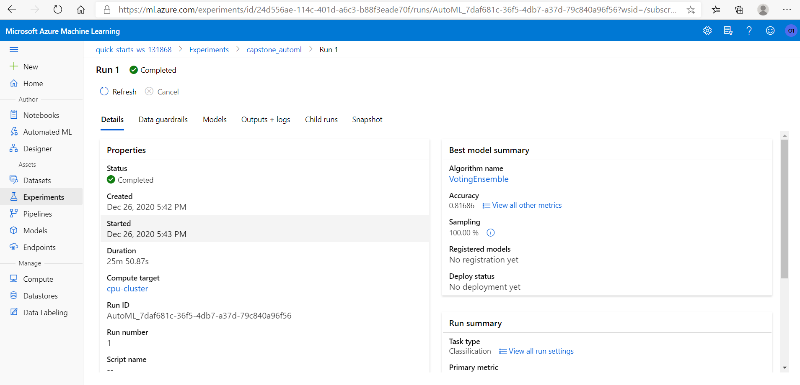

# Titanic Survaivals

In this project we will use Titanic dataset to predict if a passanger will survive or not, we will try to concepts here, first we will user Azure AutoML and custome sklearn logistic regression with Azure Hyperparameter tuning.

## Dataset

### Overview
In this project we are using Titanic dataset, it contains information about passangers on a titanic ship, we get the data set from [openml]("https://www.openml.org/data/get_csv/16826755/phpMYEkMl")

### Task
The main goal of the project is to predict if the passanger will survive or not

### Access
We use the following code to get the data from the web site as follow:

```
remote_dataset = TabularDatasetFactory.from_delimited_files("https://www.openml.org/data/get_csv/16826755/phpMYEkMl")
ds = remote_dataset.to_pandas_dataframe()
```

after that we will save the data and get it from azure store as follow:

```
if "data" not in os.listdir():
    os.mkdir("./data")

if not os.path.isfile("data/titanic.csv"):
    training_data.to_csv('data/titanic.csv',index = False)
    
# get the datastore to upload prepared data
datastore = ws.get_default_datastore()

# upload the local file from src_dir to the target_path in datastore
datastore.upload(src_dir='data', target_path='data')

# create a dataset referencing the cloud location
dataset = Dataset.Tabular.from_delimited_files(path = [(datastore, ('data/titanic.csv'))])
```

## Automated ML

Azure AutomML automating the process of finding the best model that gets the best metric for you instead of writing algorithms, trying different models and different hyperparameters and comapre all results to get the best model which is a time consuming process.

Azure AutomML automating the process of finding the best model that gets the best metric for you instead of writing algorithms, trying different models and different hyperparameters and comapre all results to get the best model which is a time consuming process.


we need to predict if a passanger is survived or not so our task is classification, the primary_metric her is accuracy which the automl should optimize, and the label_column_name is the value that we should predict,training_data containingthe data that we should use for training the model, max_concurrent_iterations is the max number of iterations that can excute in parallel,experiment_timeout_minutes Maximum amount of time in minutes that all iterations combined can take before the experiment terminates


### Results

In this experiment we are using AutoML, where it tries many different models and the best performing model was VotingEnsemble which making a prediction that is the average of multiple other regression models, this model acheives accuracy of 97.5%




## Hyperparameter Tuning

In this expiremnt we are using HyperDrive which helping us to cover a range of hyperparameters to find the best combination of parameteres to acheive the goal which in our case is Maximizing the Accuracy

to detirmine the hyperparametrs what we need to pass to the model and the range of values to cover we are using RandomParameterSampling, which takes the max number of iteration(--max_iter) as a chice of enumeration and the Regularization Strength (--c) as a value between .1 and 1

Another argument that we pass to the hyperdriveconfig is the stopping policy, we are using BanditPolicy, in our case each run which is less than 95% of the best performing run will be terminted, this will eliminate runs that get rsults we don't need.

There is the main argument which is the estimator which is your algorithm that you will apply, we are using SKLearn, this estimator takes the train.py which is the script file that contains your custome code.

The custome code in the train.py using the sklearn LogisticRegression and a method for cleaning the the data, splitting the data to training and testing set. 

### Results

The best run we acheive accuracy of 81.7 with max iterations of 75 and Regularization Strength of .34, we can improve the model by make more processing on data and increase space range of hyperparameter to check if we can get better results


## Model Deployment

After registering our hyperdrive model we will use the following code to deploy our model as a web service, we will deploy it on ACI as a real time inference service

```
deployment_config = AciWebservice.deploy_configuration(cpu_cores = 1,
                                                       memory_gb = 1,
                                                       auth_enabled=True,
                                                       enable_app_insights=True)

service_name = 'hyperdrivewebservice'
service = Model.deploy(ws, service_name, [model],deployment_config=deployment_config)
service.wait_for_deployment(True)

```

To consume the serive we will use the following code

```
data = {
  "data": [
    {
                  "pclass": 1,
                  "sex": 1,
                  "age": 20,
                  "sibsp": 1,
                  "parch": 1,
                  "embarked": 2
    }
  ],
  "method": "predict"
}

input_data = json.dumps(data)

primaryKey, secondaryKey = service.get_keys()

scoring_uri = service.scoring_uri

# Set the content type
headers = {'Content-Type': 'application/json'}
# If authentication is enabled, set the authorization header
headers['Authorization'] = f'Bearer {primaryKey}'

# Make the request and display the response
resp = requests.post(scoring_uri, input_data,headers=headers)

print(resp.json())
```


## Screen Recording
We have provided a  that demonstrate:
- A working model
- Demo of the deployed  model
- Demo of a sample request sent to the endpoint and its response
